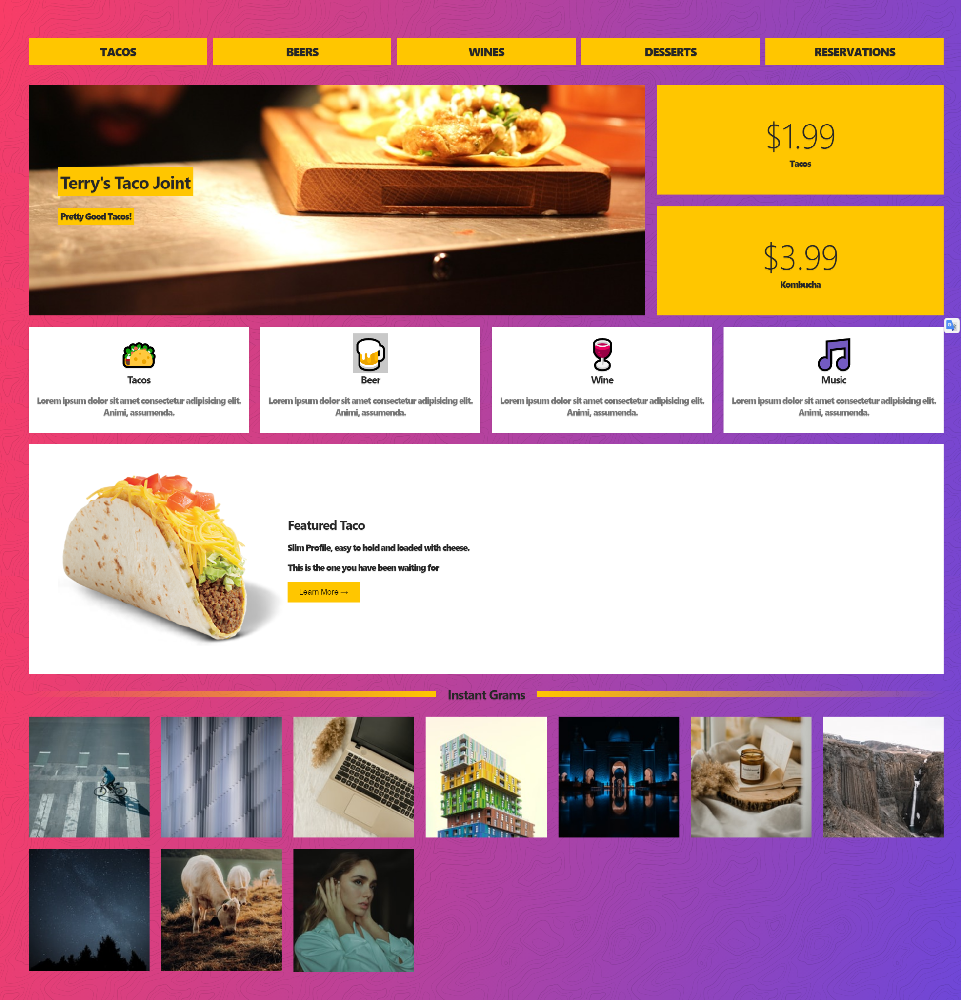
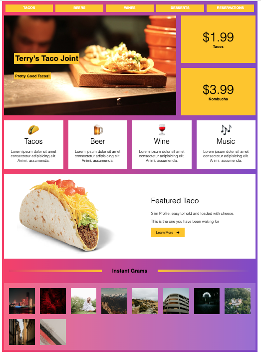

**HTML and CSS Unit Assessment**

**Section B Case (20 points Total)**

**Build a Restaurant Website**

  -------------
  **Context**
  -------------

HTML (the Hypertext Markup Language) and CSS (Cascading Style Sheets)
are two of the core technologies for building Web pages. HTML provides
the structure of the page, CSS the (visual and aural) layout, for a
variety of devices. Along with graphics and scripting, HTML and CSS are
the basis of building Web pages and Web Applications.

  ----------------------------
  **Task (20 points total)**
  ----------------------------

In this project, you are assigned to use HTML and CSS to create a static
webpage for a restaurant, with your solid knowledge of HTML and CSS. You
will be aligning the different food items and drinks using a CSS layout
grid. You can add prices, images and need to give it a beautiful look
and feel as well using the proper combination of colors, font-style and
images. By the end of this project, you will have styled some
rectangular blocks and created a static webpage.

You are suggested to use a "What You See Is What You Get" (WYSIWYG) HTML
editor for this project. For example, Froala is a front-end WYSIWYG HTML
editor designed to provide optimized performance for users. With a GZIP
core of only 50 KB, this lightweight software can load within 40
milliseconds. The software is also optimized for mobile and is
compatible with Android and iOS devices.

**Required elements in the webpage:**

1.  Basic HTML Tags in the file: home.html (8 points total, 2 points
    each)

    a.  Paragraph Tags \<p\>\</p\>\
        Eg: \<p\> This is a paragraph \</p\>

    b.  Break Tag \<br\>\
        Eg : \<p\> This is an Example of \<br\>\
        \</p\>

    c.  Heading Tags \<h\#\>\
        Eg : \<h1\> This is a heading \</h1\>

    d.  Image Tag\
        Eg: \

2.  A CSS file called style.css and reference it in your .html file. (12
    points total, 6 points each)\
    Write at least 2 CSS rules to style.

    a.  Add the picture topography.svg from the folder-images as the
        background of the page.

    b.  Use grid container contains grid items (please refer the
        reference picture)

The image resources are available in [[this
folder]{.ul}](https://drive.google.com/drive/folders/1X9ZXg9jFKPcGwgB01_uuHuThzYdRXEWr?usp=sharing).

A sample page is shown below as a reference:

# My Response 

